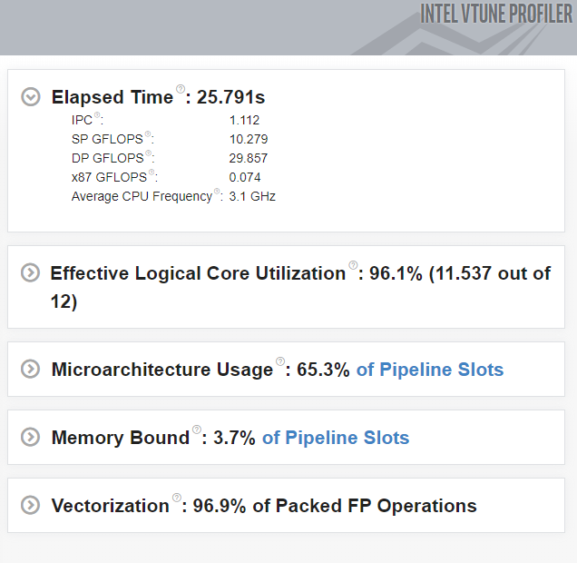
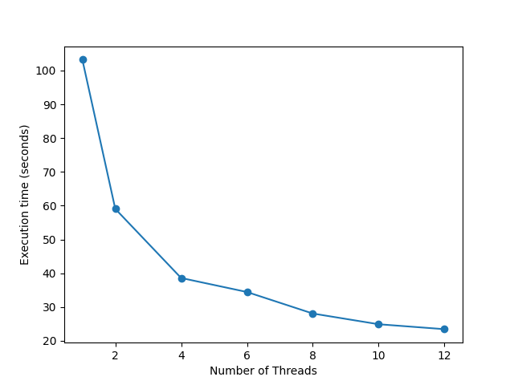
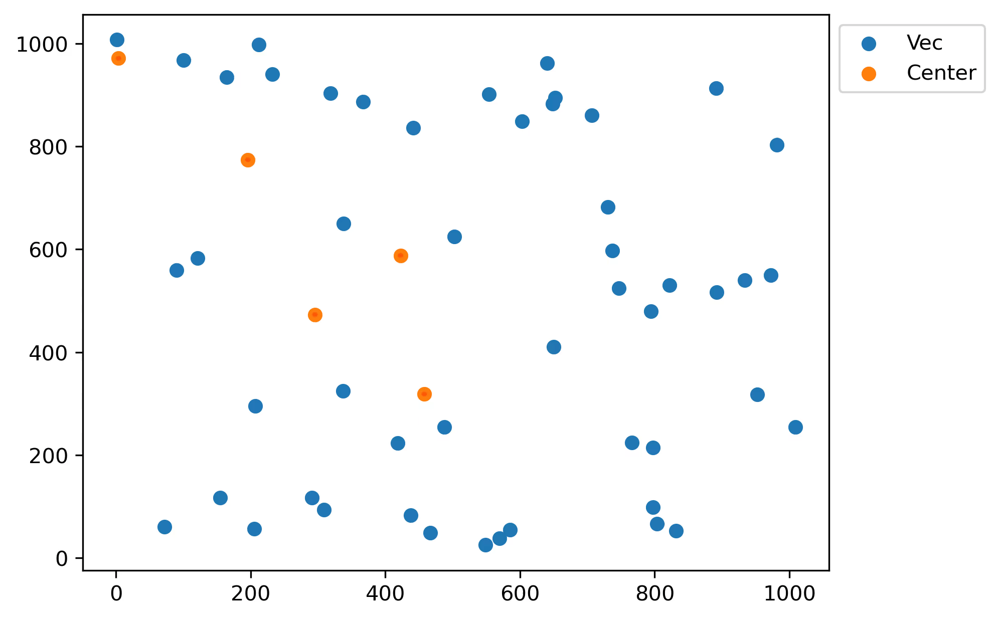

# K-Means in Parallel
This is an implementation of the well known clustering algorithm K-Means. The implementation was done in `C++ 17`. The IDE used for the project was Visual Studio 2019 and the compiler was Intel Compiler 19.1. The *Effective Logical Core Utiliation* percentage was 96.1 %. 

The program was also tested with different number of available threads, and the scaling is pictured below.

There is a [PDF project report](parallel-programming-lab-2.pdf) in Greek.

